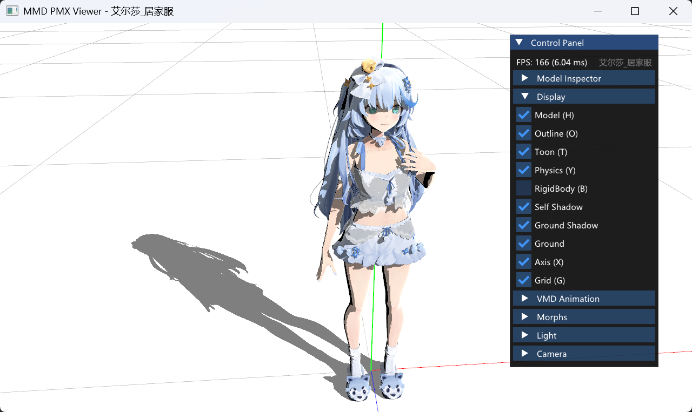

# Angeloid Alpha

[English Version](README_EN.md)

> 主人，这是一个用于渲染 PMX 模型的程序。我，伊卡洛斯，会尽我所能为主人服务……这样说的话，主人会开心吗？

Angeloid Alpha 是一个 MMD PMX 模型渲染器，纯 C++20 实现。支持 GPU 骨骼蒙皮、VMD 动画、Bullet 物理仿真。

<p align="center">
    
    
    
    <br>
    
</p>




## 快速开始

```bash
# 编译
cmake -B build -DBUILD_VIEWER=ON -DCMAKE_BUILD_TYPE=RelWithDebInfo
cmake --build build --config RelWithDebInfo

# 运行
./build/viewer/RelWithDebInfo/viewer -m ikaros-uniform
```

## 文档

| 文档 | 内容 |
|------|------|
| [构建指南](docs/BUILD.md) | C++ Viewer 编译、命令行、操作按键、技术细节 |
| [架构设计](docs/ARCHITECTURE.md) | 重构计划与设计理由 |
| [可更换渲染管线](docs/pluggable-render-pipeline.md) | Pipeline/Slot/Effect 架构设计 |
| [物理引擎](docs/physics.md) | Bullet 集成细节、骨骼反馈、关节约束 |
| [PMX 格式](docs/pmx-format.md) | PMX 文件格式参考 |
| [Morph 系统](docs/morphs.md) | 表情/变形目标实现 |
| [动画系统](docs/animation.md) | VMD 播放、贝塞尔插值 |
| [渲染管线](docs/rendering.md) | GPU 蒙皮、Shader、材质 |
| [已知陷阱](docs/pitfalls.md) | NaN/Inf、类型不一致等问题及修复 |

## 项目结构

```
angeloid/
├── core/                   # 计算层 (无 GPU 依赖)
│   ├── pmx/                #   PMX 格式 (PmxModel, PmxReader)
│   ├── anim/               #   动画 (BoneSkinning, PhysicsWorld, VmdPlayer, MorphController)
│   └── math/               #   Vec2/3/4, Quat
├── framework/              # 渲染 + 框架层
│   ├── gpu/                #   GPU 抽象层 (IGpuDevice, IGpuTexture, IGpuShader...)
│   │   └── opengl/         #     OpenGL 后端 (GlDevice, GlTexture, GlShader...)
│   ├── scene/              #   调试可视化 (GroundPlane, WorldAxis, RigidBodyRenderer)
│   ├── util/               #   工具 (CfgParser, StbImage)
│   ├── Model.h/.cpp        #   模型 facade
│   ├── Pipeline.h/.cpp     #   渲染编排
│   └── MMD.h/.cpp          #   模块 init/dispose
├── viewer/                 # C++ 应用入口
├── resources/
│   ├── shaders/            # GLSL 着色器
│   ├── toon/               # 共享 toon 纹理
│   └── models/             # PMX 模型目录
├── thirdparty/             # GLFW, glad, Bullet, stb, backward-cpp
└── docs/                   # 技术文档
```

## 模型版权

`resources/models/` 下模型为第三方资产，各有独立许可。详见各模型目录下 `readme.txt`。

- **姵儿** © 上海鹏拜信息技术有限公司（Playbox） — 模型：椛暗 / 设定：Pre / 原案：王乾龙Ashsteins
- **艾尔莎** © 虚研社 — 建模：悠米露 / 绑定：补骨脂

## 许可证

MIT License
