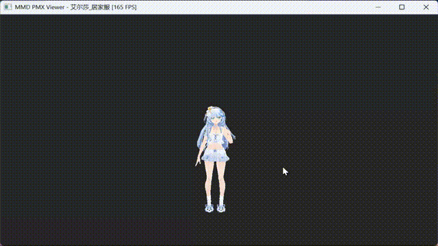

# Angeloid Alpha

[中文版](README.md)

> Master... this is a program for rendering PMX models. I, Ikaros, will do my best to serve you.

Angeloid Alpha is a pure C++20 MMD PMX model renderer. Features GPU skeletal skinning, VMD animation playback, and Bullet physics simulation.

<p align="center">
    
    
    
    <br>
    
</p>



## Quick Start

```bash
# Build
cmake -B build -DBUILD_VIEWER=ON -DCMAKE_BUILD_TYPE=RelWithDebInfo
cmake --build build --config RelWithDebInfo

# Run
./build/viewer/RelWithDebInfo/viewer -m ikaros-uniform
```

## Documentation

| Document | Contents |
|----------|----------|
| [Build Guide](docs/BUILD.md) | C++ Viewer build, CLI, keyboard shortcuts, technical details |
| [Architecture](docs/ARCHITECTURE.md) | Design rationale |
| [Pluggable Render Pipeline](docs/pluggable-render-pipeline.md) | Pipeline/Slot/Effect system design |
| [Physics](docs/physics.md) | Bullet integration, bone feedback, joint constraints |
| [PMX Format](docs/pmx-format.md) | PMX file format reference |
| [Morphs](docs/morphs.md) | Expression/blend shape implementation |
| [Animation](docs/animation.md) | VMD playback, Bezier interpolation |
| [Rendering](docs/rendering.md) | GPU skinning, shaders, materials |

## Project Structure

```
angeloid/
├── mmd/                   # C++ core library
│   ├── pmx/               # PMX format (PmxModel, PmxReader)
│   ├── anim/              # Animation (BoneSkinning, PhysicsWorld, VmdPlayer, MorphController)
│   ├── render/opengl/     # Rendering (ModelRenderer, Pipeline, GPU wrappers, debug viz)
│   ├── util/              # Utilities (CfgParser, Log)
│   └── math/              # Vec2/3/4, Quat
├── viewer/                # C++ app entry point
├── resources/
│   ├── core/              # Engine resources (shaders, effects, toon)
│   └── app/               # App content (models, vpd, vmd)
├── thirdparty/            # GLFW, glad, Bullet, stb, backward-cpp
└── docs/                  # Technical docs
```

## Model Credits

Models under `resources/app/models/` are third-party assets with independent licenses. See each model's `readme.txt` for details.

- **姵儿** © Shanghai Playbox Information Technology Co., Ltd. — Model: 椛暗 / Design: Pre / Planning: 王乾龙Ashsteins
- **艾尔莎** © Xuyan Studio (虚研社) — Modeling: 悠米露 / Rigging: 补骨脂

## License

MIT License
